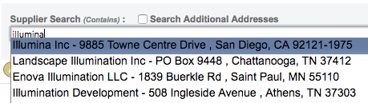
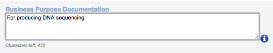
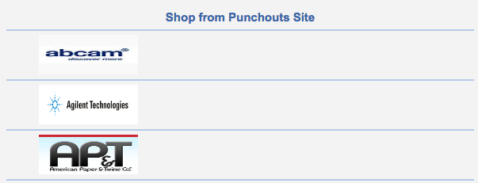
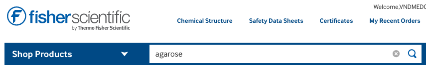
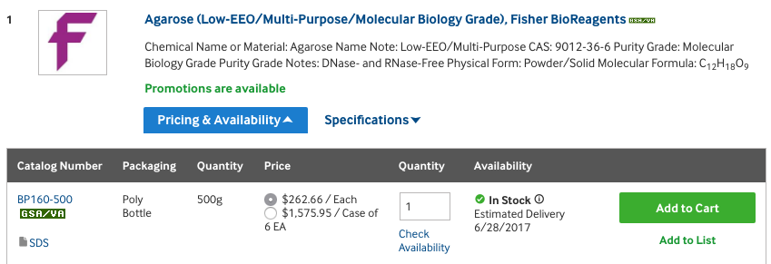
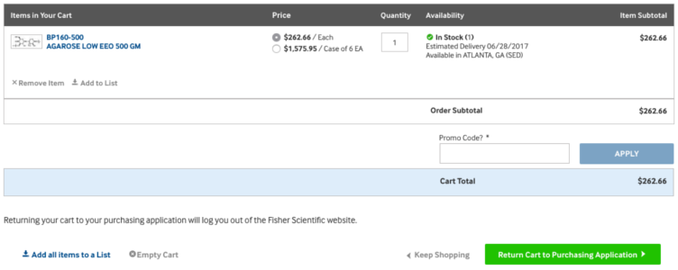
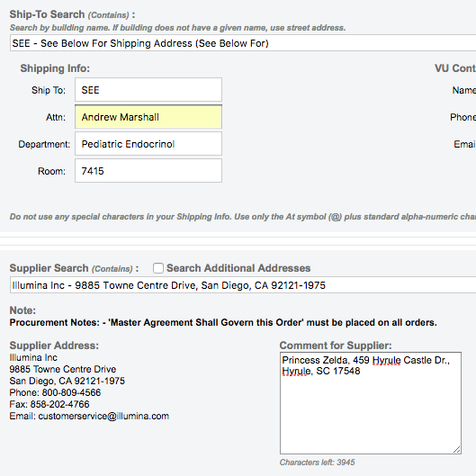
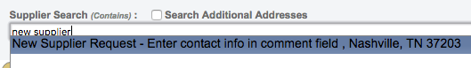

# eProcurement

**eProcurement** is Vanderbilt's interface for ordering products. It can be accessed via [this link](https://webapp.mis.vanderbilt.edu/asap/Worklist.action) or by [searching "vanderbilt eprocurement" on Google](https://www.google.com/search?q=vanderbilt+eprocurement).

The general workflow is as follows: 1. The **creator** \(that's you\) creates a requisition for one or more products. This is sent to the approver. 2. The **approver** \(someone in charge of the center number, [often from Peds Endo](admin-asst.md#bethany-oates)\) reviews the order for accuracy and necessity for the specified projects. Once approved, it is sent to the buyer. 3. The **buyer** \(someone in the VUMC purchasing department\) actually creates the purchase order \(PO\) and submits it, via email or fax, to the supplier \(the company which sells the product\). 4. The **supplier** receives the order and ships the products to the lab.

On average, it takes about 2 days from the time you submit the requisition to the time the supplier receives the order, so keep that in mind when you need a product to be shipped. It's usually better to get orders in as soon as you know about them. However, if you need something approved right away or you feel like they're taking too long, feel free to email the approver to remind them to check on requisitions awaiting their approval.

For commonly ordered items, see [Common Lab Supplies](common-supplies.md).

## Regular requisition

For some suppliers, you'll need to go through the [eCatalog system](eprocurement.md#ecatalog-requisition) to order items.

For all other suppliers, you'll submit a regular requisition.

On the top menu bar of the eProcurement home screen, click on **Requisition**. This will create a new blank requisition.

Search for the supplier in the search bar. Give it a few seconds after you type, since sometimes it's a little slow. Select the supplier that you want from the results box that drops down.

Type in the information about the product that you want to order.

- **Quantity**: how many of this product that you want.
- **UOM**: unit of measurement. I always use **EA - Each** for this, which you can get by pressing **E** once on the keyboard while this field is highlighted.
- **Item \#**: the suppliers product number for this product. This can be found on the supplier's website.
- **Item Description**: some text that describes this product. Usually I just copy/paste what the supplier has on their website for this field.
- **Commodity**: the category that Vanderbilt will use for accounting, or something. I always use **Laboratory Supplies**, since pretty much everything we buy will be used in a lab.
- **Price**: the price per unit of this item.
- **Ext Amount**: the total price of the item\(s\) in this row. This will auto-calculate based on the quantity and price that you specify.
- **Account**: again, used for some accounting by Vanderbilt. I always use 60150, which stands for "Lab Supplies".
- **Center**: the center number that you'd like to spend money from to buy this product.
- **Slid**: I don't know. You don't have to change this.
- **Slac**: I don't know. You don't have to put anything here.
- **Percent**: if you want to split a purchase among more than one center number, put the percentage that you want to go on this center number here. Otherwise this should be 100%.
- **Amount**: the total cost that will be allotted to the center number in this row. This will auto-calculate based on the total item price and the percentage.

To add another item to the requisition, press the yellow plus icon on the right side.

If you leave the **Account** and **Center** fields blank until after you've finished adding all the items, you can click the link on the top-right that says **Set Default Distribution**, and it will pop up a window that allows you to enter the account and center numbers once, and it will fill it for all the items.

There's also a large-ish text box in the supplier section that you can use to send a message for the supplier if needed. For example, when ordering [ear tags](mouses/ear-tags.md) you should put the range of tag numbers in this box so the supplier knows what you want.

When you're finished entering all the information on this page, press the **Continue** button at the very bottom of the page.

On the next page, the only thing you need to do is justify your purchase in the **Business Purpose Documentation** box. Since all of our funding comes from grants with specific purposes, all purchases need to have an explanation of why it pertains to that grant. These don't have to be ultra-detailed; usually I just stick with something like, "Strainers for splenic tissue processing" or something like that. The approver will let you know if your description is not good enough and have you re-submit if that's the case.

When you're done explaining yourself, press **Continue** at the bottom of the page.

This next page is just for review. I also copy any pertinent information \(e.g. requisition ID\) in this requisition to the [Ordering spreadsheet](mouses/spreadsheets.md).

When you're satisfied, press **Submit** at the bottom of the page. This sends it to the approver.

## eCatalog requisition

eCatalogs are vendor sites that are configured to interface with the eProcurement system \(this interface is known as a "punchout"\), so you don't have to type in all the product information yourself.

On the top menu bar of the eProcurement home screen, click on **Shop eCatalogs**.

This will take you to a very ugly page with a list of company logos on the right side.

Click on the company that you'd like to order from. This will bring you to that vendor's punchout site.

> If the vendor's punchout gives a message like "You are logged out", it's probably not going to work. To fix it, go back to the vendor selection page, or just start completely over.

Most vendors' punchouts have a search bar where you can search by the name of the product or by the product code. Use that to find the product that you'd like to order.

Enter the quantity that you'd like to order and press add to cart. If you've ever shopped for anything online, this should conjure up fond memories.

Go to your shopping cart. This will have a summary of all the stuff you've added to the cart so far. Check to make sure it's all correct, and then press **Return to punchout application** or **Submit** or something that seems like it will do that. They're all slightly different.

This will bring you back to a very ugly page with yet another summary of your order. Press **CHECKOUT** at the bottom.

This will bring you back into the normal eProcurement page. From here on out, it will be exactly the same as submitting a [regular requisition](eprocurement.md#regular-requisition), except that all the product-related information will be pre-filled.

## Special situations

### You have a quote from a supplier

This often happens if you get a special deal from the supplier or it's a quote-only product.

Just enter the information as it appears on the quote. On the second page \(where you enter the justification for the purchase\) there's a box called **Attachments**. Upload the quote file using this box.

### Ship to a different location

If you'd like to enter a different address than the lab address, type **SEE** in the **Ship-To Search** box on the first page of the requistion form. Enter the alternate address in the **Comment to Supplier** field after selecting a supplier.

### Supplier not in eProcurement

If the supplier is not in eProcurement but you know that they accept purchase orders, you can request to add them to eProcurement.

Search for "new supplier" in the **Supplier Search** box and select the only result that appears. Enter the supplier's information as prompted in the **Comment to Supplier** field.

### Supplier doesn't accept purchase orders

If the supplier doesn't accept purchase orders, you'll need to contact one of the Peds Endo [administrative assistants](admin-asst.md) and ask to use the P-card to buy it. The administrative assistants will work with you to get the purchase approved and put through.

The P-card is just a credit card associated with the department, but to prevent people from buying delicious superfluous pizza and scary Halloween masks with grant funds, there is only one and it requires a lot of approvals to get stuff purchased with it. You won't have to do this very often, but if you need to buy something from a regular store \(like a small fridge from Home Depot\), you'll need to use the P-card.
