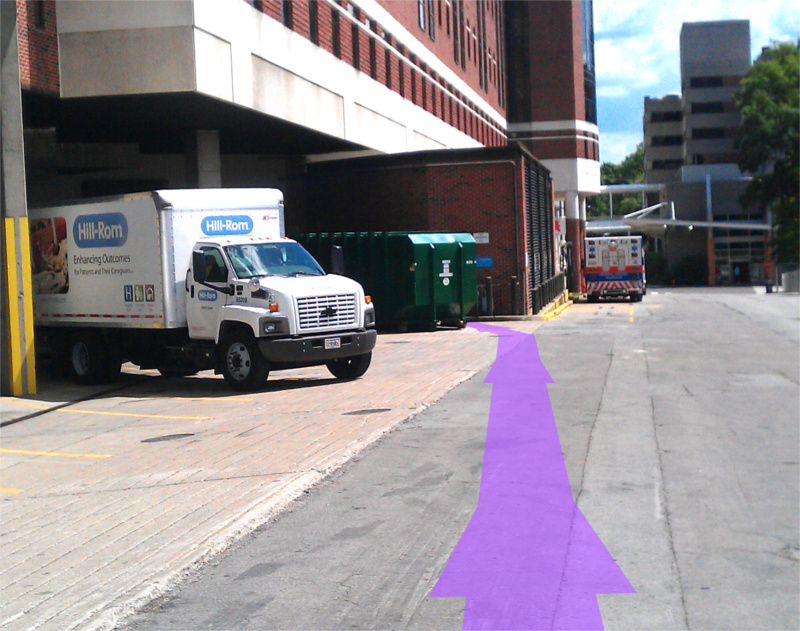
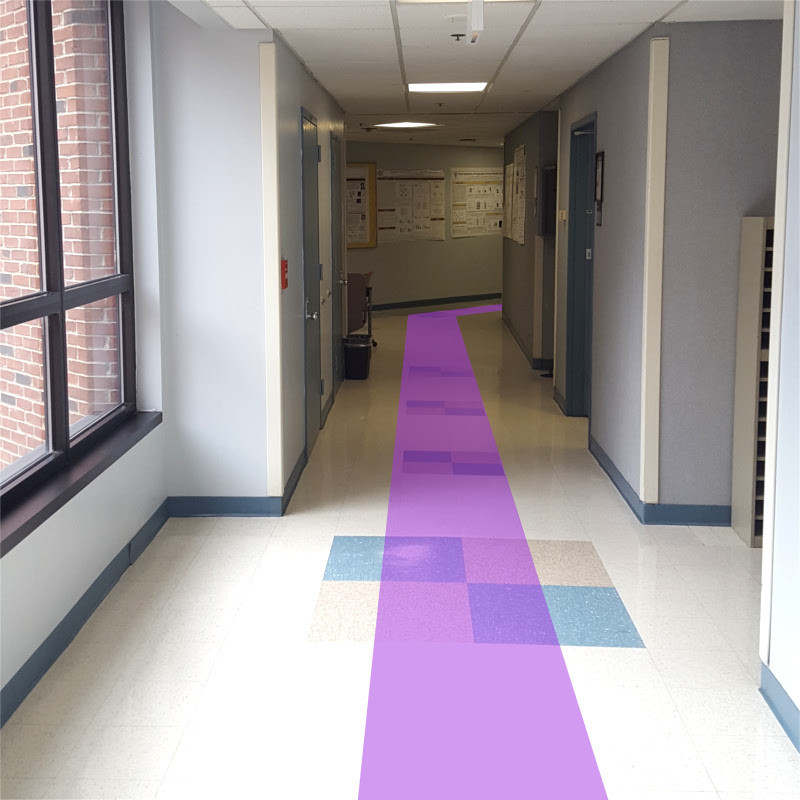
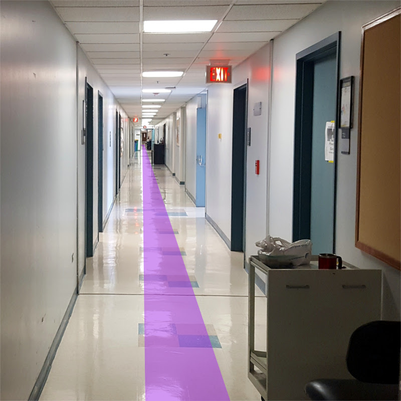
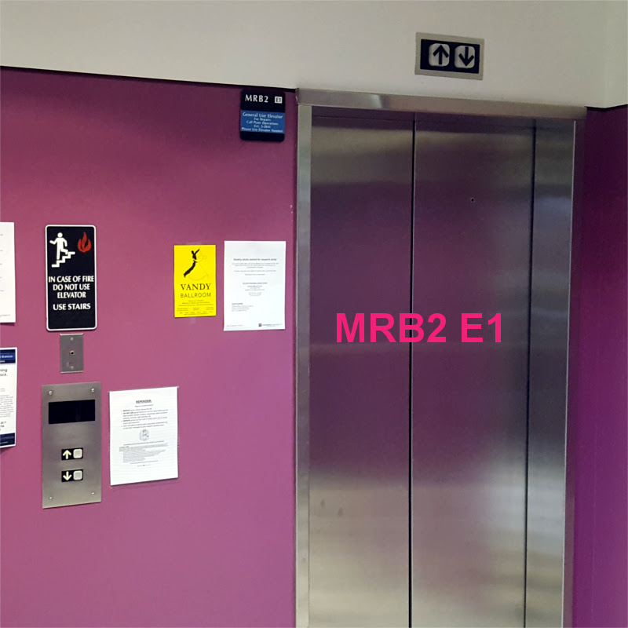
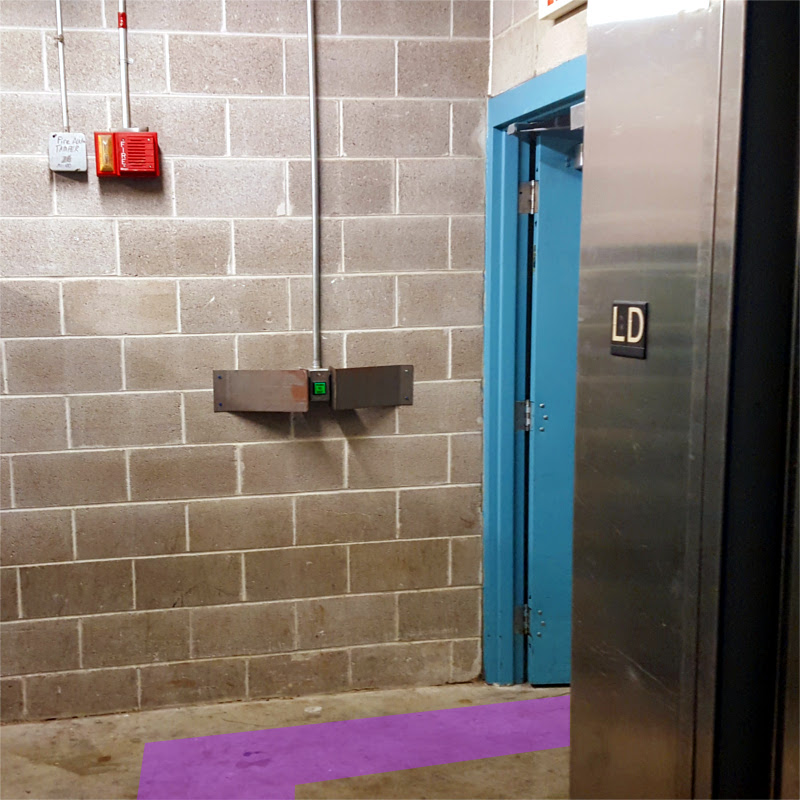

# Ethanol

## Buying ethanol

For some reason, buying lab-grade ethanol is extremely expensive from the normal suppliers, so we have to buy it directly from Vanderbilt Medical Center.

You can only purchase it from Vanderbilt from 2pm-3pm on Tuesdays and Thursdays, so be sure to get the 1180 before then.

### 1180 form

The first thing you’ll need to do is get an 1180 Requisition Form from the [Peds Endo administrative assistant](https://github.com/moorelabvanderbilt/moorelabwiki/tree/98d9c43e779d8205afd02a9948443bf49c9a4a16/admin-asst/README.md). Shoot him/her an email about this, including the following information:

* **Units ordered**: 4
* **Unit of issue**: gallon
* **Description**: 100% lab-grade ethanol, 4x1 gallon bottles
* **Amount**: the price - this fluctuates, but it's usually around 40. I think they can leave it blank and you can write it in when you get the ethanol.
* **Center Number**: the center number you'd like to charge the purchase to.

The administrative assistant will email you when the 1180 is approved and ready to pick up. Go to VAV and get it.

The 1180 should look something like the below picture when you get it. It will be 3 carbon copies \(yellow, pink, white\).

### Getting to the vendor

Again, the place is only open from 2pm-3pm on Tuesdays and Thursdays, so don't bother trekking all the way over there if it's not the right time.

You may want to bring a cart to transport the box. 4 gallons of ethanol weighs about 25 lbs, so you probably don't want to carry that all the way back to the lab.

There are two routes to get to the vendor: outside and inside.

#### Outside route

Walk out of Light Hall following the purple line:

Behind Robinson and Preston there’s a loading dock - this is where you’re going. Head to the far end of the loading dock and go behind the large green dumpster.

You’ll see a small set of stairs and a door. Go through the door.

Look to the right-ish direction, you’ll see some blue doors at the end of a small hallway. If Blair is standing there like in the picture, steal _his_ box of ethanol. Otherwise, go to that door on the right.

#### Inside route

From the lab exit, go down the hall toward the restrooms, and turn the corner into the 7th floor atrium. Go through the double doors on the other side of the atrium into Light Hall. Go straight to the end of the hallway, following the purple line in the photos.

Turn right at the end of the hallway, and then turn left before the 3 elevators.

Continue down this hallway, around the soft right.

Continue, taking the soft left.

!\[soft left\]\(/uploads/ethanol/ethanol-00010-a.jpg "this left's softness leaves something to be desired"\)

Continue down this long hallway.

Continue through into Preston Research Building.

Turn left at the first hallway to the left.

Now at this elevator bay, you need to take the elevator on the right side \(MRB2 E1\). If the other elevator gets called instead, just get in and press the button for 1 and then get out. Once the door closes, press the button for down again, and the right elevator should come next.

Once you get the correct elevator, get in and press the button for LD.

!\[elevator buttons\]\(/uploads/ethanol/ethanol-00016-a.jpg "LD stands for 'lackluster dungeon'"\)

Stepping out, go to the right, through the blue double doors.

The door where the ethanol lives is right in front of you. You've arrived! Congratulations!

!\[ethanol storage\]\(/uploads/ethanol/ethanol-00019-a.jpg "It's a McDonald's on Mon-Wed-Fri. Closed for both alcohol and quarter pounders on weekends."\)

### The actual transaction

There should be an employee there who will accept your 1180 in exchange for the box of 4 gallons of 100% ethanol. If there isn't, check the small windowed room in the same area. If there isn't anyone there at all, then come back on the next Tuesday or Thursday. It's a highly refined system.

Anyway, if you find someone, they'll have you write the price of the ethanol on the 1180 and sign it. Then they'll keep the top copy of the carbon copies, and you'll keep the other two. Take the 1180 and your ethanol and bring it back to lab.

At your convenience, bring the 1180 back to the [Peds Endo administrative assistant](https://github.com/moorelabvanderbilt/moorelabwiki/tree/98d9c43e779d8205afd02a9948443bf49c9a4a16/admin-asst/README.md).

