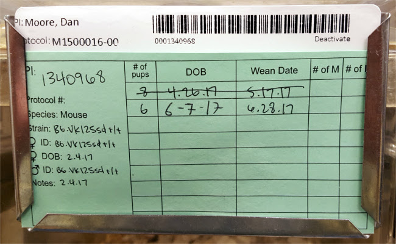
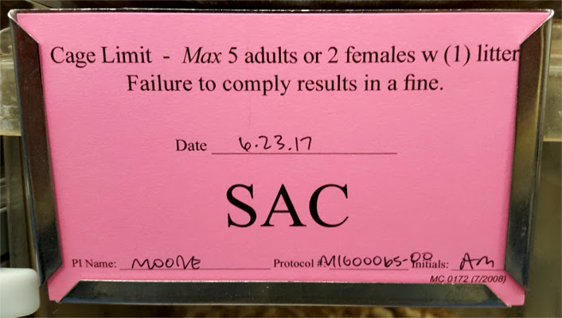
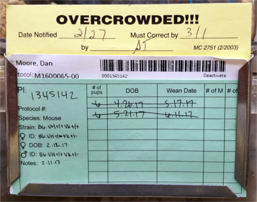
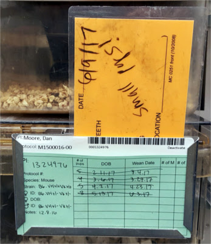
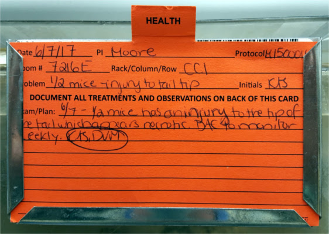
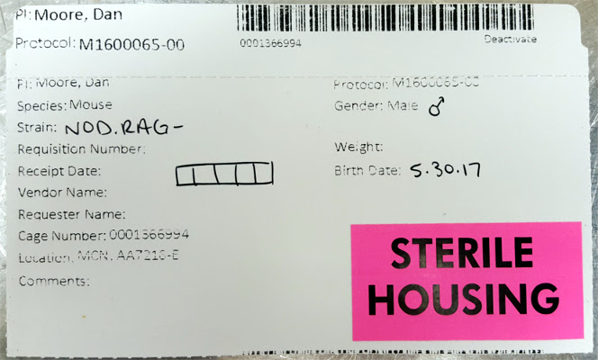

# cage-cards

## Cage cards

These cards uniquely identify the cage and other associated information.

### Obtaining new cage cards

There is a link from the [DAC website](https://www.vanderbilt.edu/acup/dac/) to the Cage Card Request Form. The form is fairly self-explanatory. Cards are usually delivered the next day.

To save time, you can use the Chrome extension [Web Developer Form Filler](https://chrome.google.com/webstore/detail/web-developer-form-filler/gbagmkohmhcjgbepncmehejaljoclpil?hl=en) to save the filled form so you can easily re-submit this form the next time you need cage cards. This extension is already installed on the RA iMac in lab, and can be accessed via the pencil icon in the top right of the Chrome browser window.

### How we use the cage cards

We use the cage cards to identify the mice in that cage.

When writing a cage card, we usually include the following information:

* **Strain**: the strain of the mice.
  * This is the most important. Many of our strains of mice look exactly the same physically, so it is important to mark the strain of mouse on the cage card so different strains do not get mixed up accidentally.
* **Age**: the age of the mice.
  * We often keep mice born on the same or similar days in the same cage, so this age applies to all the mice in the cage.
  * This could be left blank if the ages are different, not important, or identified via another method \(i.e. ear tag\).
* **Sex**: the sex of the mice.
* **Number of mice**: this is what those boxes mean. For ease of census-taking, we mark usage of mice in the cage by putting an X in a box when we remove a mouse. The number of open boxes is how many mice remain in the cage.

Here's a typical cage card:

#### Activating cage cards

You'll notice in the above picture the barcode tabs on the top and bottom of the card.

When you activate a new cage card, you must indicate on the bottom tab how many mice are being added _to the colony_. Note that this means if you are weaning mice from a breeding cage, write the number of mice that you are adding to the cage. However, if you are moving mice from a pre-existing cage into a new cage, write 0 as the number on the activation tab, since no new mice are being added to the overall colony.

Place the tab in the plastic sleeve on the outside of the suite door.

#### Deactivating cage cards

When you need to deactivate a cage card \(because you are taking the mice back to lab for experiments, sacking the mice, or replacing the card\), simply tear off the top slip of the card and place it in the plastic sleeve on the outside of the suite door.

### How DAC uses the cage cards

DAC scans all of the cage cards in the mouse room _weekly_ to confirm their census for billing us. However, they scan all of the tear-off barcode tabs placed in the sleeve on the mouse suite door _daily_ to activate new cages or sacking old ones. Therefore, to avoid continuing charges on cages that you have deactivated, remember to leave the deactivation tab in the sleeve on the door before you leave the mouse room.

## Indicator cards/stickers

These cards and stickers indicate special statuses of mice in that cage.

### Breeding cards

These are the light green cards.

Use these to indicate that a cage is a breeding cage, and you can also write the strains, ages, and pup information in the fields of the card. DAC will sometimes write in a birth date if they notice a new litter, but otherwise they ignore these cards.

### Sac cards

These are the fluorescent pink cards.

Use these to indicate to DAC that you no longer need the mice in that cage, and that you'd like them to sac the mice at their convenience. Usually they do this on Fridays. On weeks when DAC is changing the cages, they appreciate it if you place your sac cards before they change the cages, since they will not have to change the cage if it is going to be deactivated and sacked.

### Dead animal card

These are the purple cards.

DAC uses these to indicate to you that one or more dead mouse was found in the cage. Usually this is not very concerning, but if it's a breeding cage that an adult died in, then you can probably deactivate that cage, since there probably won't be any more breeding going on.

### Overcrowd card

These are the yellow cards.

DAC uses these to indicate that there are too many mice in a cage. Usually this means that there is a litter in a breeding cage that is old enough to wean. They write on the card when they noticed the overcrowd, and what day you need to separate the mice. If you do not separate the mice by the day listed, DAC will separate them and charge us for it.

### Health alert card

These are the light orange, laminated cards.

You can use these to indicate to the veterinarians that a cage contains one or more mice with some health concern. Fill out the card, place it in the card holder, and then take the **Alert** magnet off the back of the door to the room and place it on the outside of the door so they can tell that they need to visit the room and check those mice.

Often this card is used to request a weaning extension for weanlings that are old enough to wean but look too small to survive on their own. See [mouse breeding](https://github.com/moorelabvanderbilt/moorelabwiki/tree/98d9c43e779d8205afd02a9948443bf49c9a4a16/mouses/mouse-breeding/README.md) for more details.

Animal care techs also use this card to request a veterinary inspection, so if they place one on a cage, don't remove it.

### Health concern card

These are the dark orange, unlaminated cards.

These are used by the vets only. They use these to indicate a confirmed health problem with one or more of the mice in the cage. They write on the card what treatment is necessary, how often it should be performed, and who is responsible for the treatment.

### Sterile housing sticker

These are the pink stickers that say **STERILE HOUSING** on them.

Use these to indicate cages with mice that should be housed in sterile cages, given sterile food, and supplied water via a bottle rather than through the Lix-it.

### Do not feed/water card

These are the red cards.

Use these to indicate a cage that should not recieve water or food from DAC. This means that you must include a completed [Do Not Feed/Water form](https://www.vanderbilt.edu/acup/dac/forms/) in the sleeve on the back of the door, and monitor the mice as indicated on that form.

### Research notes card

These are the grey cards.

Use these to indicate miscellaneous information that doesn't belong on any other cards. DAC personnel will usually ignore these.

You can also use these in a pinch if you have run out of cage cards or any other type of card.

