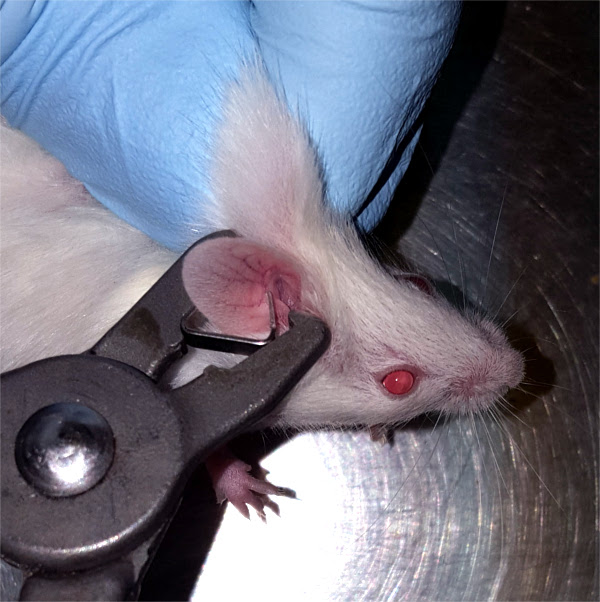

# Ear tags

**Ear tags** are small metal tags that attach to the ear of a mouse. They are numbered so that individual mice can be identified using the number.

## Applying ear tags

Place the ear tag into the applicator with the opening facing out.

Scruff the mouse and position the applicator with the tag around the mouse's ear as shown.

It's best to get the tag fairly deep on the ear, just past the first ridge of the ear. If it is too far out on the edge of the ear, the mouse can rip it off. You should also aim to avoid clamping the folds of the ear together, as this can get infected.

Squeeze the applicator to close the ear tag around the mouse's ear.

## Purchasing ear tags

The ear tags that we typically buy are [product number 1005-1 from National Band & Tag](https://nationalband.com/products/la-1005-1/).

They take about 1 month to ship to us, so keep that in mind when you're running low on the old set.

You can purchase ear tags through eProcurement by creating a normal requisition with the company set to National Band & Tag.

The only difference is that you need to put the range of numbering you'd like on the tags in the **Comment for supplier** field \(e.g. "tag numbers 500-999"\).

I generally buy 500 tags at a time.
