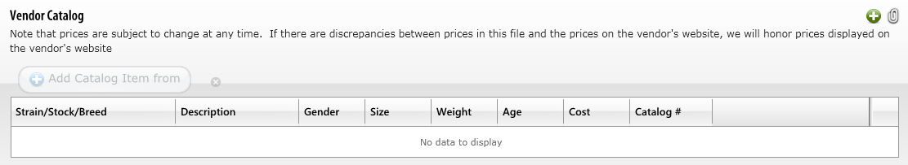
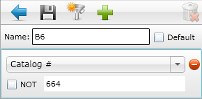
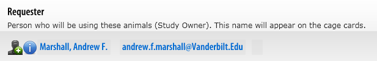
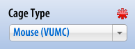

# mouse-ordering

## Detailed TOPAZ workflow

### Getting to Topaz

1. Open Firefox. It doesn’t work on Chrome.  
2. Go to this address: [https://topazelements.mc.vanderbilt.edu/TOPAZElements/app/login/login.html](https://topazelements.mc.vanderbilt.edu/TOPAZElements/app/login/login.html)  
   * If this doesn’t work, go to the Vanderbilt DAC website \([search “vanderbilt dac” on Google](https://www.google.com/search?q=vanderbilt+dac)\) and there should be a link to Topaz from the DAC's homepage.  
3. You should be at a login screen. Log in using your VUnet ID.  

### Starting a new order

You should be a screen that looks something like this:

Click on **Animal Orders** under Operations, on the right. This will bring you to a screen like this:

Hover over the mouse on the left and a menu should pop up as pictured.  
Click on **Create New Order**. On the next dialog that pops up, select **Create New Animal Order**.

### Protocol Information

This will bring you to the ordering form.  
Where it says “Protocol and Species”, click the **green plus button** to the right. This will bring up a dialog to select a protocol.

Here it shows the animal protocols assigned to you and the Moore lab.  
Select one of them, depending on what the mice will be used for, and it will close the dialog window.

After you select a protocol, the protocol number will populate in a field on the first page.  
After it does so, press the **Save** button up near the top of the page, and the rest of the information should now populate as well.

Press **Next** at the bottom of the screen.

### Order Information

The first field of this screen is the Vendor Catalog.

Press the **green plus button** on the right of this field to bring up the Vendor selector.

Select the vendor that you’ll be purchasing the mice from, and this will close the dialog box.

Now the **Add Catalog Item from** button should be active, and it should list the vendor you selected next to it, as pictured.  
Press the **Add Catalog Item from** button and another dialog box will appear.

Here you will select what strain and age of mouse you want.

If you already have filters set up, then great!  
Select the strain of mouse from the **Filter dropdown** and skip the next section.

If you don’t have filters set up yet, then follow along.

#### Filter set up

Since the search bar at the top of this page doesn’t work very well, you’ll need to set up filters so that you can search for the specific strain of mouse that you’d like to order.

Click on the **Filter editor button** at the top right \(it looks like a silver funnel with a blue arrow pointing left\).  
It will pop out a sidebar with some filter options in it.  
Click on the **New Filter** button \(a silver funnel with a sparkle/sun\).

This will bring up a small dialog where you can add conditions to the search.  
Usually it is sufficient to select Catalog\# and put in the number of the mouse strain, as shown.  
Give the filter a name, and then press the **save button** \(floppy disk\).  
This will add this new filter to the dropdown menu above, so the next time you order mice you don’t have to do this again.

However, if you don’t want to save this filter, you can just press the blue arrow to do a search with the conditions that you’ve selected. This may come in handy if it's a strain of mouse that you probably won't need to order again.

#### Selecting mice

Now that you’ve filtered the catalog to show only a manageable subset of the mice, you need to select specifically which mice you want to order.

There are several columns here:

* **Strain/Stock** - this indicates the full information about that strain of mouse. Usually this information will be duplicated in the other columns in a more user-friendly way, but if it’s not, you can look here for it.
* **Gender** - the sex of the mouse.
* **Catalog \#** - the vendor-supplied catalog number. If you found a mouse on a vendor website, there should be a number that they list the mouse strain by. That goes in this column.
* **Age** - the age of the mouse in weeks.
* **Cost** - the cost of each mouse in USD.
* **Size** - not the size. This indicates the genetics of the mouse strain. The values here are typically HOM \(homozygous - two copies of the transgene\), HEMI \(hemizygous - one copy of the transgene\), or nothing \(genetics are not relevant to this strain\).
* **Weight** - not the weight. This indicates a special condition of these mice. A common value here is RB, which means retired breeder - it is a mouse that once was a breeder. These mice are usually cheaper than their non-breeder counterparts.

This information about the columns is most specifically pertaining to Jackson Labs, since they are our most frequently used supplier. The other suppliers are similar, but may only have a single entry for each strain \(not separate entries for each age/sex available\). If that is the case, then you’ll need to indicate the age/sex in the **Order Notes** section on the main **Order Information** screen, after selecting the mouse strain.

Once the mouse strain has been selected, go to the **Requester** section, second from the bottom.  
This will probably say your name here, but you’ll want to change it to Dan’s name, since this is what will be printed on the mouse room cards.  
Press the **person with green plus** icon and select Dan’s name from the list.

Press **Next** at the bottom of the screen.

### Deliveries

Click on the **Schedule Deliveries** button at the top right.

This will bring up a dialog with a calendar.

Click on the date that you’d like the mice to be delivered.  
Press **OK** and the dialog will close, and the date you selected will show up in the list.  
Click on the **blue curvy arrow** to the left of the entry.  
This will bring up a screen with options about this delivery.

First input how many mice you’d like to be delivered.

Input how many mice you’d like per cage \(this is usually 5\).

Press the **green plus button** next to “Housing Location”. This will bring up a dialog window.

Input the room number \(usually it’s easier to search just by the numbers in the room, no letters\), and select the room from the results that show up.

Select **Medical Center North II** from the **Ship To Address** drop down menu.

Select **Mouse \(VUMC\)** from the **Cage Type** drop down menu.

Press the **green plus button** in the right of the **Bill To Account** section and select the center number you’d like to use to purchase the mice.

Press the **green plus button** in the right of the **Per Diem Account** section and select the center number you’d like to use for ongoing charges related to these mice.  
Usually this is the same center number as the Bill To Account number, but it doesn't have to be.

Press the **Save** button at the top again.  
The app should load for a second, and then the other buttons will become active.  
Press the **Submit** button and a dialog will pop up.

This might load for a second too.  
When **Submitted** and a blue right-arrow shows up, press the **Set Status** button.

You’re done! The mice have been ordered.

### Copying orders

You may have noticed that “Copy” button next to the “Submit” button at the top. If you have similar orders, you can copy all the input fields from an old order to a new order.

After creating the new order and selecting the protocol, save the form like usual. This should activate the “Copy” button. When you press it, it will ask you if you’re sure, and then let you pick an order to copy. Once you do it, all of the values from the old order will be input into the new order. You can then go through and change individual values like usual to fit the new order.

