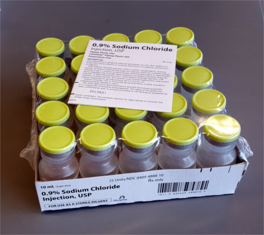
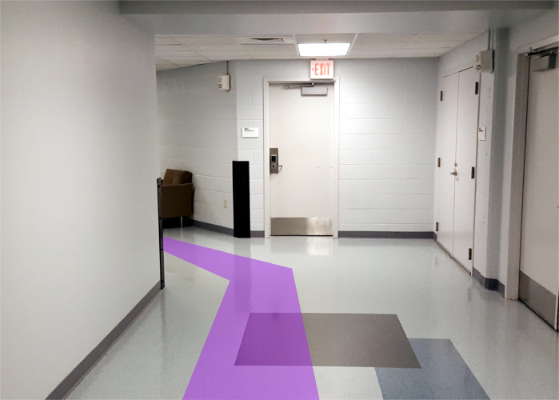
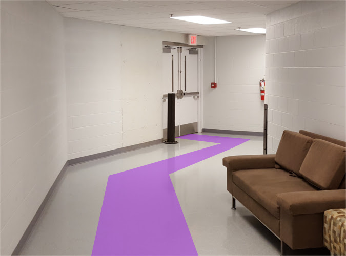
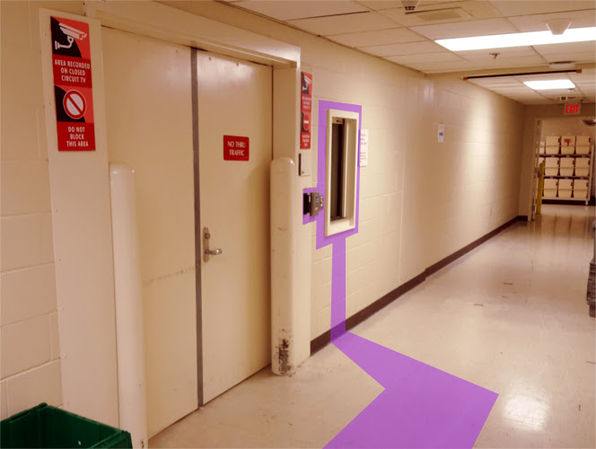

# Saline

_This page current as of 21 June 2017._

> The pharmacy intends to move to an iLab-based purchasing system soon.
> If that has happened, this page is outdated and the below **Submitting the order** section is no longer valid.

For some reason, it's been difficult to purchase the 10 mL bottles of saline via normal suppliers, so instead we purchase it from the Vanderbilt pharmacy.

This is a guide on how to purchase specifically saline, but I suppose if you wanted to buy something else from the Vanderbilt pharmacy, you'd use this same procedure.

For reference, this is what we're trying to buy:

And it comes in packs like this:

## Submitting the order

To begin, you'll need to download this form:

[pharmacy-medication-request-form-rev-5-6-2017.pdf](.gitbook/assets/pharmacy-medication-request-form-rev-5-6-2017.pdf)

Fill out the information as listed on the form. Most of the fields are pretty self-explanatory.

- **Description**: 0.9% Sodium Chloride Injection, 10 mL, 1 box of 25 units
- **Account**: 60150 is the number we use for all lab supplies

Have Dan sign the **Principal Investigator \(Signature\)** field, and then email it to [Bethany](admin-asst.md#bethany-oates) for department approval.

After it is signed and approved, email it to pharmacypurchasing@vanderbilt.edu.

You should receive an email when your order is ready to pick up. For saline, this is usually the next business day.

## Going to the pharmacy

Go out of the lab and take the elevators down to the 1st floor.

Go around the bend into the 1st floor of the main hospital.

Make a right into the main hallway.

Take the first left and you should see a set of elevators in front of you. Either take these elevators down to the basement, or take the stairs to the right of the elevator bays.

You'll be following signs leading to B-127. Turn right out of the elevator, or go straight-ish past the elevators from the stairs.

Turn right past the elevators, then turn left into a hallway.

Go to the end of the hallway and turn left \(this should be the only way you can go\).

Go about halfway down this hallway until you reach B-127.

Use the phone on the wall there to tell the people inside that you're there to pick up an order.  
You may have to sign something indicating that you've picked it up, but that should be it.

